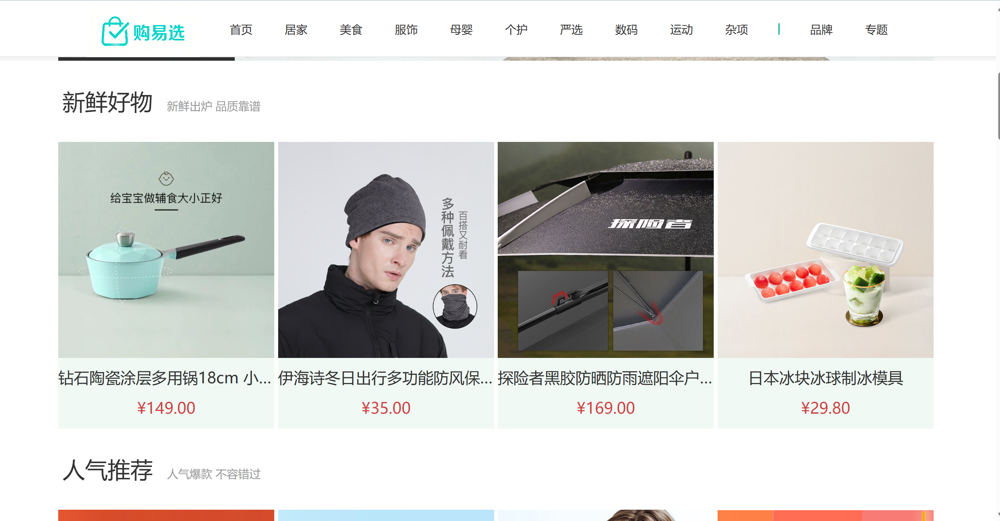
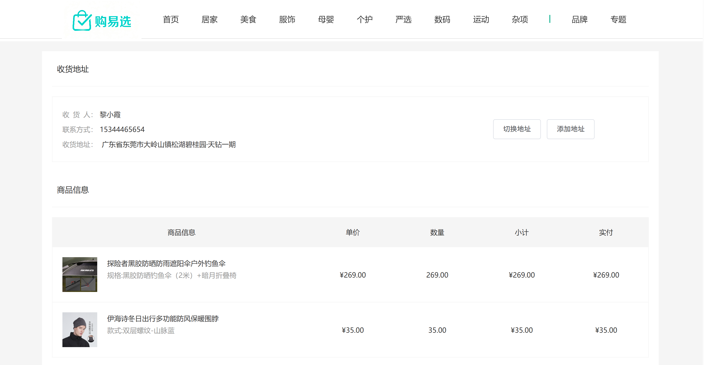

# 购易选·电商平台SPA

[](https://vuejs.org/)
[](https://vant-ui.github.io/vant/#/zh-CN)
[](https://pinia.vuejs.org/)


>一个基于 Vue3 生态开发的移动端优先电商单页应用（SPA），完整复刻了商品展示、购物车管理、订单结算等核心业务流程，首屏加载性能优化40%。

## ✨ 特性亮点

-   **🛒 完整的电商流程**：涵盖首页、分类、商品详情、购物车、订单结算全链路。
-   **📱 移动端极致体验**：使用 Vant UI，针对移动端交互进行深度优化，流畅无卡顿。
-   **⚡ 卓越性能**：通过组件缓存、图片懒加载、防抖处理等手段，优化加载速度与交互体验。
-   **🛍 复杂的SKU处理**：实现多规格商品选择器，智能匹配库存与价格。
-   **💾 状态持久化**：购物车数据使用 Pinia + localStorage 持久化，支持跨页面同步。

## 🛠 技术栈

-   **前端框架**: Vue 3
-   **状态管理**: Pinia
-   **移动端UI**: Vant
-   **路由工具**: Vue Router 4
-   **HTTP 客户端**: Axios
-   **构建工具**: Vite

## 🚀 快速开始

### 前置条件

确保你的开发环境中已安装：
-   Node.js (版本 >= 16)
-   pnpm或 npm

### 安装与运行

```bash
# 克隆项目
git clone https://github.com/L-try/vue-admin-main.git

# 进入项目目录
cd your-project-name

# 安装依赖
pnpm install

# 启动开发服务器
pnpm dev
```

## 📸 项目预览




*首页展示，包含轮播图、商品推荐与秒杀活动*


*商品分类，支持按评价、销量筛选商品*


*商品详情页，实现SKU选择器与图片预览*


*购物车页面，支持商品增删、价格计算与跨页同步*



*商品支付页面，支持切换地址以及添加地址*


*我的订单页面*


*个人中心页面，猜你喜欢组件复用*

## 📁 项目结构

text

```
src/
├── api/           		# 数据接口
│   ├── cart/           	# 购物车接口
│   ├── category/       	# 商品分类接口
│   └── checkout/       	# 支付详情接口
│   ├── detail/        		# 商品详情接口
│   ├── home/           	# 首页商品接口
│   └── .../            	# 订单、用户等接口
├── assets/             # 静态资源
├── components/         # 全局公共组件
│   ├── ImageView/      	# 放大镜
│   ├── XtxSku/         	# 商品详情款式组件
├── composables/        # 倒计时函数封装
├── dirtective/         # 图片懒加载
├── router/             # 路由配置（包含动态路由逻辑）
├── store/              # Pinia 状态管理
├── utils/              # 工具函数
└── styles/             # 全局样式
├── views/              # 页面级组件
│   ├── CartList/       	# 购物车
│   ├── Category/       	# 商品分类
│   ├── Detail/         	# 商品详情
│   ├── Home/           	# 首页
│   └── Layout/         	# 页面布局  
│   └── Login/  			#登录页
│   ├── Member/         	# 个人中心
│   ├── Pay/            	# 支付页
│   └── Checkout/       	# 支付确定页 
│   └── SubCategory/  		#筛选分类页
├── App.vue/             
├── main.ts/            # 入口文件  
```


## 🤔 实现思路与难点

- **购物车状态管理**：使用 Pinia 管理全局购物车状态，并利用 `localStorage` 实现持久化，通过监听 `window.storage` 事件实现跨标签页同步。
- **SKU选择器**：基于 Vue 计算属性处理商品规格（SKU）的多维组合、库存验证与价格联动，是项目中最复杂的逻辑之一。
- **性能优化**：使用 `keep-alive` 组件缓存、图片懒加载指令(`v-lazy`)、函数防抖等手段显著提升用户体验。

